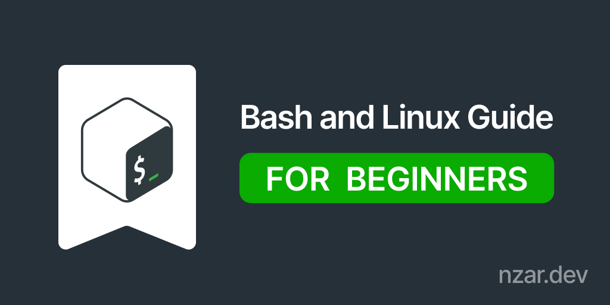

# Bash and Linux Journey

This project started as my journey to learn Linux and Bash scripting as part of a university module.

Along the way, I realized how valuable this knowledge could be, so I decided to enhance it and share it with everyone.

This guide serves as a solid starting point for anyone looking to understand Linux fundamentals and dive into Bash scripting.

---

## 📚 Table of Contents

1. [Linux Fundamentals](#1-linux-fundamentals)  
   1.1. [Basic Commands](#11-basic-commands)  
   1.2. [File Permissions](#12-file-permissions)  
   1.3. [Users and Groups](#13-users-and-groups)  
   1.4. [Process Management](#14-process-management)  
   1.5. [Regular Expressions](#15-regular-expressions)
2. [Bash Fundamentals](#2-bash-fundamentals)  
   2.1. [Introduction to Bash Scripts](#21-introduction-to-bash-scripts)  
   2.2. [Variables](#22-variables)  
   2.3. [Special Variables](#23-special-variables)  
   2.4. [Control Flow](#24-control-flow)  
   2.5. [Numbers and Strings](#25-numbers-and-strings)  
   2.6. [Loops and Iteration](#26-loops-and-iteration)  
   2.7. [Functions](#27-functions)
3. [Linux Fundamentals Test](#3-linux-fundamentals-test)  
   3.1. [Easy](#31-easy)  
   3.2. [Medium](#32-medium)  
   3.3. [Hard](#33-hard)
4. [Practical Scripts](#4-practical-scripts)\
   4.1. [Directory Organizer](#directory-organizer)\
   4.2. [System information](#system-information)  
   4.3. [Todo List](#todo)

---

## 📂 Project Structure

The project is organized into the following sections:

### 1. **Linux Fundamentals**

Learn the core concepts of Linux, from basic commands to managing processes. Files included:

- `01_basic_commands.md`: Overview of essential Linux commands.
- `02_file_permissions.md`: Managing file and directory permissions.
- `03_users_and_groups.md`: User and group management.
- `04_process_management.md`: Handling system processes.
- `Regular_Expressions.md`: Introduction to regular expressions in Linux.

### 2. **Bash Fundamentals**

A step-by-step guide to Bash scripting, covering everything from the basics to advanced concepts. Files included:

- `01_Introduction_Bash_Scripts.md`: Getting started with Bash scripts.
- `02_Variables.md`: Understanding variables in Bash.
- `03_Special_variables.md`: Overview of special variables.
- `04_Control_Flow.md`: Conditional statements and control flow.
- `05_Numbers_and_Strings.md`: Working with numbers and strings.
- `06_Loops_and_Iteration.md`: Looping constructs in Bash.
- `07_Functions.md`: Creating and using functions in Bash.

### 3. **Linux Fundamentals Test**

Test your understanding of Linux basics with three levels of challenges:

- `01_Easy.md`: Simple tasks to build confidence.
- `02_Medium.md`: Intermediate challenges to test your skills.
- `03_Hard.md`: Advanced problems, if you conquer these, you're ready for anything!

### 4. **Practical Scripts**

Real-world examples of Bash scripts to reinforce learning and showcase practical use cases:

- **Directory Organizer**: Automatically organize files into directories based on their type.
- **System Information**: Display detailed system statistics at a glance.
- **Todo List**: A simple script to manage your tasks from the terminal.

---

## 1.1 **Basic Commands**

This is a quick summary of basic Linux commands. For detailed explanations and examples, check the full guide [`01_basic_commands.md`](#).

| ID  | Command  | Description                                            |
| --- | -------- | ------------------------------------------------------ |
| 1   | `pwd`    | Print current working directory path                   |
| 2   | `cd`     | Change between directories                             |
| 3   | `ls`     | List directory contents and their properties           |
| 4   | `mkdir`  | Create new directories                                 |
| 5   | `cat`    | Display, combine, and create text files                |
| 6   | `less`   | View text files with forward and backward navigation   |
| 7   | `more`   | View text files with forward-only pagination           |
| 8   | `head`   | Display the beginning of files                         |
| 9   | `tail`   | Display the end of files                               |
| 10  | `touch`  | Create empty files or update file timestamps           |
| 11  | `cp`     | Copy files and directories                             |
| 12  | `mv`     | Move or rename files and directories                   |
| 13  | `rm`     | Remove files and directories                           |
| 14  | `tr`     | Translate or delete characters in text                 |
| 15  | `wc`     | Count lines, words, and characters in files            |
| 16  | `ln`     | Create hard or symbolic links between files            |
| 17  | `locate` | Find files by name using system database               |
| 18  | `find`   | Search for files and directories with complex criteria |
| 19  | `grep`   | Search for text patterns in files                      |
| 20  | `cut`    | Extract sections from lines of files                   |
| 21  | `awk`    | Pattern scanning and text processing language          |
| 22  | `sort`   | Sort lines of text files                               |
| 23  | `uniq`   | Report or omit repeated lines                          |
| 24  | `diff`   | Compare files line by line                             |
| 25  | `cmp`    | Compare files byte by byte                             |
